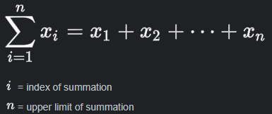
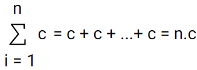
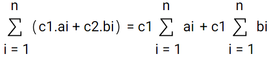
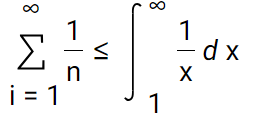

# SOMATORIOS
#### 26 DE MARÇO DE 2024

   

em c/c++ :
``` c
for (i = 1; i <= n; ++i)
     x[i]
```

#### PROPRIEDADES
Seja *n, c* ∈ **Z** e ai e bi sequencias de inteiros, Entao:  

1.
   

2.
  

**OBS**: 
   

> NOTA HISTÓRICA:   
> Anos 60, Kenneth E. Iverson
> - Posicao dos operadores: pre, in, pos
> - associatividade inconsistente:  
>    - (a + b) + c
>    - a<sup>(b<sup>c</sup>)</sup> 

#### SOMAS TELESCOPICAS

Definição: seja {a<sub>i</sub>} é uma sequencia de inteiros .
Entao a **Soma telescopica** para a sequencia de {a<sub>i</sub>} é dada por:

**Σ**<sup>b</sup><sub>i=a</sub> a<sub>i+1</sub> - a<sub>i</sub>

     